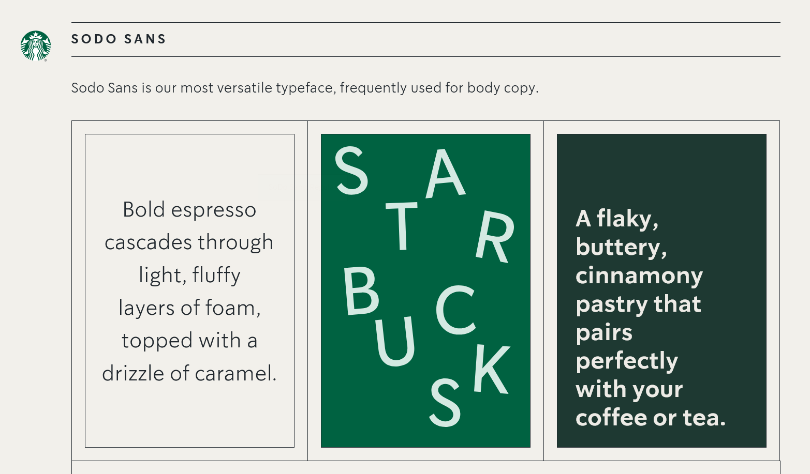
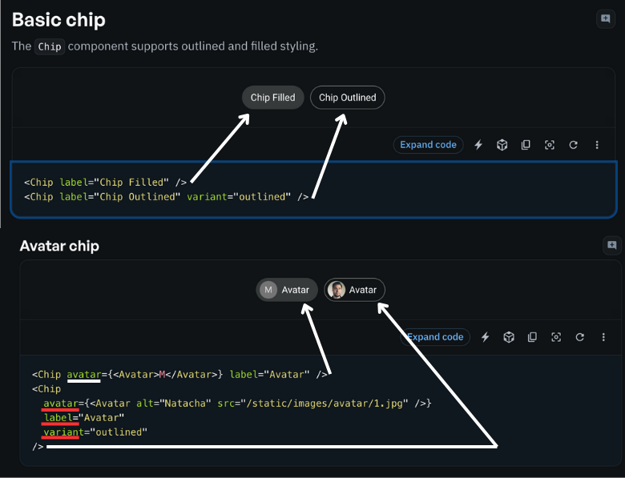
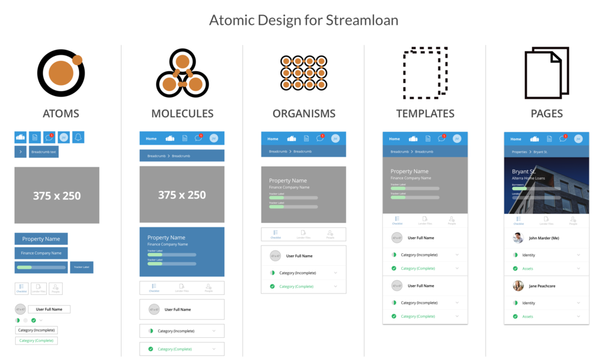
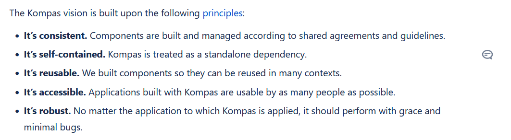

# Design Systems

[[toc]]

This literature study will focus on the following research question:

*How might we best automate the reporting to Kompas stakeholders about key success metrics about its usage between designers and 
developers that use it?*

In particular the sub-question that has to be tackled first, is:

What makes up a Design System?

Why do we need to know this? It's because we need to understand what a Design System is in order to interact with one. Once we are able to understand and interact with it, we can measure the different aspects that make up a good design system. This is important for the success of the project.

## What makes up a Design System?

A Design system is a group of parts that are all in service of reaching a goal of unified design everywhere it is applied. Commonly it includes a Style guide, a Component library, and a Pattern Library. Depending on what the consumer of the Design system wishes to achieve, at the very least the Style guide must be referred to and its standards must be followed. From there, both the Component Library and Pattern Library act as a repository of shared and published components that can be efficiently reused and edited. Simply put, Design systems aim to improve collaboration, scalability, quality assurance, development time and strengthen an organization's identity. 

These are also the parts that make up Kompas, as I have learned from the internal documents at Jumbo.

To further elaborate on the different parts of a Design System:

- **Style guide**:

A style guide or brand guidelines is a collection of rules or standards aiming to set the look and feel of a brand. Its goal is to be recognizable and a consistent source of truth for designers and developers on how to visually incorporate all graphical elements in their product in a way that represents the brand. It can include elements such as typography, brand colors, tone of voice, logos, and how to use spacing, layouts, and other brand assets. 

Here is an example of a style guide from [Starbucks](https://creative.starbucks.com/logos/)

This includes relevant brand standards such as colors, typography, and tone of voice. Any members of the company that release anything to consumers should refer to this guide to make sure consistency and brand identity is upheld. In addition to this, it is also a good idea for any internal facing material to follow this style guide wherever it is practical. This creates a sense of unity and professionalism for workers. 

- **Component library**: A library that contains components that can be used to build up the UI of an application. They follow the style guide rigidly. A single component can be dynamic, robust and versatile. The figure below shows the versatility of a single component. Googles Material Design system includes many component libraries, in particular, the Material UI React library is a popular choice for many developers. On their documentation, they show how a single component can be used in many ways. In particular, the Chip component has several attributes that can be changed to make it look different, such as variant, avatar, and label. Above each code example is a picture of what the component looks like. 

- **Pattern library**: A pattern library is a combination of components that are used to create larger element. This could be in the form of showcasing all the different types of buttons that are available, or all the different types of cards or all the different types of form components. Pages are made up of patterns.

### Benefits of Design Systems

 

#### Ease of Collaboration 

With Design Systems, developers and designers can work hand in hand, whenever a Pattern or part of the brand is updated, it is updated in the Design System. This means that everyone is always on the same page, and time is not wasted on communicating changes. In general terms, having a design system moves the life of design within a company out of shared cloud drive folders, emails, and instant messages, and into a single organized, designer and developer friendly place.
 
#### Scalability

As a general rule, with design systems, if you change something, that change propagates to all projects in which the Design system is a dependency. For component library changes, everywhere the component is used on the site, For example if a button is found in 10 places (each instance owned by different teams), and the color or text size is changed, it will change in all of those 10 places provided they are all using the same version of the Design system. This is very beneficial for large companies that have many teams working on different projects. 

#### Quality assurance

To improve quality of digital product such as a web app, it is crucial to know that all the elements of the UI are vetted for how well they achieve certain metrics such as Consistency, Satisfaction, Coverage, Efficiency and Productivity. These are the metrics that I will use in the Dashboard in order to measure the success of Kompas. 

#### Development time

Design systems like Kompas can save a lot of Development time, the components are ready to use and the pattern you would like to implement as a developer has already been designed for you. If we do not task developers with designing the UI, they can focus on the ares their role includes, and then they only have to uphold the design system guidelines. 

#### Strong brand identity 

Consistency within companies digital products is often difficult to achieve. Having clear brand guidelines, and a rich pattern library even designers can reuse and edit, ensures that the brand is upheld. Design tokens for example are a way to ensure that designers have the final say of important brand aspects like colors, spacing, layout and element sizes. For example, in Kompas, The values that Designers set in Figma for their Design token are collected when the all instances of the web application are run. 

### Building a Design System

 

#### Adopting Atomic Design

Atomic Design is a methodology created by Brad Frost aimed at categorizing different UI elements / components by size. A single element can be the fundamental building block (an atom), or a combination of atoms to form a molecule, or a combination of molecules to create an organism, or finally a combination of organisms to create a template.

When using Atomic Design, there is clear component hierarchy when building large UIs, at Jumbo for example, Kompas uses atomic design, and it shows in the way the components are structured, in Figma files patterns are shown, which are a combination of atoms, molecules and organisms. And then there is another file to represent how the shared ecommerce web application(s) are structured, this is an example of full templates. 

Here is an example of how Atomic Design is split into different levels:

Atomic was introduced by Brad Frost in his book [Atomic Design](https://atomicdesign.bradfrost.com/). Since then, it has become a popular framework for building design systems and has been adopted by many organizations, including IBM and Shopify.

#### Developing UI Components

UI components are the building blocks of a design system, such as buttons, forms, and navigation bars. They should be reusable, flexible, and easy to customize, allowing designers and developers to create a wide range of interfaces without starting from scratch.

These components are created based on designs and patterns that are created in the pattern library with the companies principles and brand guidelines in mind. This is how the 3 layers of a design system are connected.

The leading tech companies tend to create component libraries using React, Angular, or Vue.js. From there it is a good idea to publish these libraries as npm packages, so that they can be easily shared and reused across projects. These libraries are then used to build the UI of their products.

#### Documenting the System

Documentation is a critical part of any design system, as it provides a reference for designers and developers to understand how the system works and how to use it effectively. It should be clear, concise, and up-to-date, providing information on everything from design principles to component usage.

Documentation can take place on many platforms such as Confluence, Notion, Google Docs, a companies internal wiki, or even a custom-built website. The most important thing is that it is accessible and easy to update, easy to access, readable, concise and fills in all the missing pieces of the design system.

Design principles can encompass a variety of areas, like simplicity, uniformity, accessibility and user-friendliness. They should be easy to understand, brief and actionable offering a structure for decision-making and issue solving.

As an illustration let's take a look at the design principles of Kompas, an in house design system, at Jumbo Supermarkten;

Reusable, flexible and easily customizable components empower designers and developers to craft interfaces without starting from scratch.

These components are derived from designs and patterns established in the pattern library keeping the companies principles and brand guidelines at the focus. This relationship forms the backbone of a design system with its three layers.

Prominent tech companies often develop component libraries using frameworks, like React, Angular or Vue.js. It's practice to package these libraries as npm packages, for sharing and reuse across projects thereby leveraging them to construct their product UIs.

The key aspect is ensuring that the design system is user-friendly easily updatable, accessible, concise and comprehensive, in addressing all aspects.

**Continuous enhancement** plays a role, in the development of the design system with a focus, on evolving iteratively based on user input and established metrics.

By adopting Nathan Curtis approach companies foster a culture of collaboration, innovation and user centricity improving both processes and user interactions.

 **Establishing Guidelines and Best Practices**; Setting guidelines on how to use the design system and offering practices, for designers and developers.

 **Promoting Collaboration and Communication**; Encouraging team members to work and communicate effectively to ensure alignment on goals. The effectiveness of a design system relies on the teamwork so fostering a culture is vital. Having a support network can ensure everyone is aligned with the objectives. Prompt responses are essential, for maintaining the relevance and timeliness of the design system.

### Conclusion

Design Systems make collaboration between developers and designers easier, more scalable, and more time efficient for development. Additionally, it can improve overall quality standards and help foster a strong brand identity.

The key aspects of a Design system are its component library, pattern library and style guide.

The style guide governs standards such as colors, typography, design principles, tone of voice, how assets are used, how spacing is utilized. It ensures consistency for the brand

The component library is a code repository of shared re-usable components that have the standards of the style guide already applied to them. Developers can easily import them into their projects. 

The pattern library is a collection of components that showcase the design patterns of specific categories of elements, such as how buttons and forms might work within our Design system. 

Kompas, Jumbos design system has all of these elements present, along with a robust documentation of all of these items, ensuring that developers and designers have all the context necessary to work with the design system fluidly. 

To understand collaboration at Jumbo and other large companies, it is also important to be familiar with the Design system contribution model by Nathan Curtis, and the Atomic design methodology by Brad Frost.

Now that we are able to properly define what a Design System is at a high level, what are the optional elements it contains, and how we might work together and structure components within one we can move on to the next step. The next step is to understand how we can measure the success of a Design System. This is important because we need to know what we are measuring in order to automate the reporting of these metrics.

<!-- ## How to measure a Design System

- Key metrics for evaluating the impact and effectiveness of a design system
- Tools and techniques for tracking and analyzing these metrics -->

### Sources

- [Comprehensive guide to Design Systems](https://www.invisionapp.com/inside-design/guide-to-design-systems/)
- [Design System contribution model](https://medium.com/eightshapes-llc/defining-design-system-contributions-eb48e00e8898)
- [Atomic Design](https://atomicdesign.bradfrost.com/)
- [Atomic Design revolutionizing Frontend Engineering](https://www.linkedin.com/pulse/atomic-design-revolutionizing-frontend-engineering-remon-botros-rykfc)
- [Starbucks Style Guide](https://creative.starbucks.com/logos/)
- Internal Kompas Documents from Jumbo Supermarkten

<!-- ## Expert Interviews  -->
 