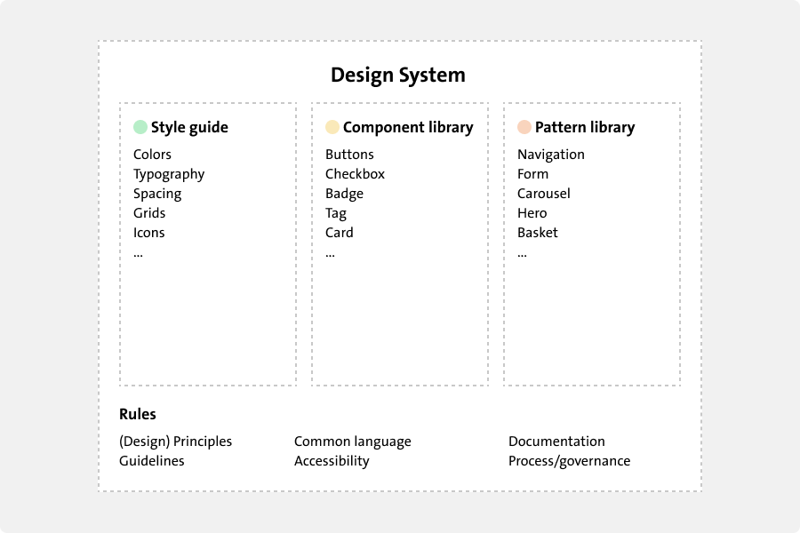

# Design Systems

## Literature Study

### What makes up a Design System?

A Design System is a collection of reusable components, guided by clear standards, that can be assembled together to build any number of applications. It serves as a single source of truth for designers and developers, ensuring that everyone is on the same page and that the product is consistent and cohesive.

A Design System typically includes the following elements:

- **Style guide**: The core values and beliefs that guide the design of the system, such as simplicity, consistency, and accessibility as well as the visual and verbal elements that define the brand, such as colors, typography, and tone of voice.
- **Component library**: The building blocks of the system, such as buttons, forms, and navigation bars, that can be combined to create interfaces.
- **Pattern library**: Common design solutions for recurring problems, such as search bars, carousels, and modals, that can be reused across projects.

### Benefits of Design Systems

 

#### Consistency

A design system ensures that all products and features have a consistent look and feel, which helps to establish a strong brand identity and build trust with users.

#### Efficiency

Design systems save time and effort by providing a library of pre-built components that can be easily reused across projects. This allows designers and developers to focus on creating new features and experiences, rather than reinventing the wheel each time.

#### Scalability

Design systems are scalable, meaning they can grow and evolve over time to meet the changing needs of a product or organization. This flexibility allows teams to adapt to new challenges and opportunities without starting from scratch.

#### Collaboration

Collaboration is key to the success of any design system. By bringing together designers, developers, and other stakeholders, a design system can foster a culture of teamwork and shared ownership, leading to better outcomes for everyone involved.

Having components, patterns, and guidelines in one place makes it easier for teams to work together and stay aligned on the vision and goals of a project.

#### Improved User Experience

By providing a consistent and cohesive experience across all touchpoints, a design system can help to improve the overall user experience. Users will be able to navigate products more easily, understand how to interact with them, and feel confident in their interactions.

In a lot of ways, improving the Developer Experience (DX) is just as important as improving the User Experience (UX). A well-designed design system can make it easier for developers to build and maintain products, leading to faster development cycles, fewer bugs, and a more enjoyable working environment.

#### Cost-effectiveness

Design systems can help to reduce costs by streamlining the design and development process, improving efficiency, and reducing the need for rework. By investing in a design system upfront

Reusing components and patterns across projects can also help to reduce the time and effort required to build new features, leading to faster time-to-market and increased productivity which translates to cost savings.

### Building a Design System

 

#### Adopting Atomic Design

Atomic Design is a methodology for creating design systems that breaks down interfaces into smaller, reusable components, such as atoms, molecules, organisms, templates, and pages. By starting with the smallest building blocks and working up to larger structures, designers can create more flexible and scalable systems that can be easily adapted to different contexts.

It prioritizes consistency, scalability, and reusability, making it an ideal framework for building design systems. By following the principles of Atomic Design, designers can create more cohesive and coherent products that are easier to maintain and update over time.

It was introduced by Brad Frost in his book [Atomic Design](https://atomicdesign.bradfrost.com/).

#### Defining Design Principles

#### Creating a Style guide

#### Developing UI Components

#### Designing Patterns and Templates

#### Documenting the System

### Implementing and Maintaining a Design System

- Understanding the contribution model
- Integration with Design and Development Processes
- Training and Onboarding
- Versioning and Updating
- Governance and Ownership

### Real-World Examples

- Case studies of successful design system implementations
- Analysis of different approaches and outcomes

### Challenges and Solutions

- Common challenges in building and maintaining design systems
- Strategies to overcome these challenges

### Future Trends and Innovations

- Predictions for the evolution of design systems
- Emerging technologies and methodologies

### Conclusion

- Recap of the importance and benefits of design systems
- Final thoughts on the future of design systems

## How to measure a Design System

- Key metrics for evaluating the impact and effectiveness of a design system
- Tools and techniques for tracking and analyzing these metrics

### Sources

- [How Pinterest Design Systems team measures adoption](https://www.figma.com/blog/how-pinterests-design-systems-team-measures-adoption/)
- [Design Systems Metrics](https://www.uxpin.com/studio/blog/design-system-metrics/)
- [How to measure success of a Design System](https://www.telerik.com/blogs/how-to-measure-success-design-system)
- [Comprehensive guide to Design Systems](https://www.invisionapp.com/inside-design/guide-to-design-systems/)
- [How to measure Design System adoption](https://uxdesign.cc/how-to-measure-design-system-adoption-a17d7e6d57f7?gi=56bd74e071a4)
- [How to measure the dev side of a Design System](https://zeroheight.com/help/guides/how-to-measure-the-dev-side-of-a-design-system/)
- [Design System metrics collection](https://designstrategy.guide/design-system/design-system-metrics-collection/)
- [Design System audit](https://www.ramotion.com/blog/design-system-audit/)
- [Design System contribution model](https://medium.com/eightshapes-llc/defining-design-system-contributions-eb48e00e8898)
- [Atomic Design](https://atomicdesign.bradfrost.com/)

## Expert Interviews
